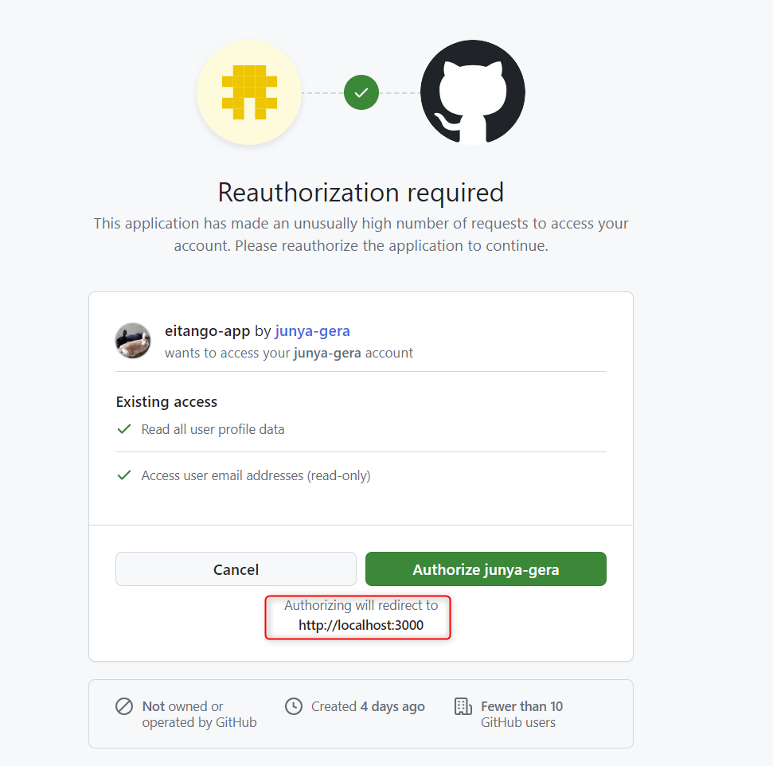

2024/03/23(Satur)
直接飛んでほしいページは URL を設定
そうでなければ URL は使わない

前にやったことの記録やソースにコメントを残していないので思い出さないといけない。
作業記録はつける。

↓ 前回のメモ
---
test/setting と test/result はやめて、 /test のコンポーネントとして扱う。

1. TestSetting から Test に showSetting を true にすることとどんな設定かを渡す。
2. 設定のとおりの単語一覧を取得し、 TangoTest に切り替わる。
3. テストが終わったら showResult を true にし、 TestResult を表示。

とりあえず TestSetting から showSetting を true にすることはできたはず。
---

残りタスク
- 〇リザルトの覚えた件数が1ずれる
- 〇覚えた数によってリザルトに表示する文字を変更する
- 単語追加・編集画面の品詞のラベルの位置がおかしい
- 〇テスト設定で入力した内容をテストに反映させる
- テストする単語をランダムにし、設定した数だけ出題されるようにする

### リザルトの覚えた件数が1ずれる
最初の1問目で「覚えた」を押したときに 0 になっている。
これが解決できたら記事にできるか？

一応解決した。
以下のようにしたとき、最初の1回目の console になぜか 1 ではなく 0 と表示される。

```ts
  const updateIsPassedAndChangeNextTango = (isPassed: Boolean) => {
    updateIsPassed(props.tangos[currentIndex].id, isPassed);

    if (isPassed) {
      setPassCount((prevPassCount) => prevPassCount + 1);
    }
    console.log(`passCount: ${passCount}`);
    changeNextTango();
  };
```

そのため最初の1回目が問題かと思っていたが、以下の記事を見ると console に表示されるのが古くなるのは仕様で、
実際の state は更新されているらしい (実際画面に表示した passCount は正しい) 。

https://zenn.dev/takuty/articles/c032310a6643ac
→ 参考資料に mseeeen の記事が！
https://qiita.com/honey32/items/ee8d1577e68b0d58678d

qiita のほうを読むと、console の表示が古いのは setState が非同期処理だからというのは関係がなく、
 JS のクロージャという仕様が関係している。
関数はその関数の外側にある変数の値をキャプチャするため、関数内で +1 したとしても、
関数内で参照するのはその処理が行われる前の状態の変数。

という JS の仕様から、 React の State は「最新の state は次のレンダリングのときにしか反映されないようになる」
という仕様になる。

そのため、原因は最後リザルトに passCount を渡す際そのまま passCount を渡していることだった。
+1 した値を渡すようにすると解決。

```ts
  const updateIsPassedAndEndTest = (isPassed: Boolean) => {
    updateIsPassed(props.tangos[currentIndex].id, isPassed);
    if (isPassed) {
      setPassCount((prevPassCount) => prevPassCount + 1);
    }
    console.log(`passCount: ${passCount}`);
    setCurrentIndex(0);
    props.showResult(passCount);
  };
```

↓ 最終的なコード

```ts
  const updateIsPassedAndChangeNextTango = (isPassed: Boolean) => {
    updateIsPassed(props.tangos[currentIndex].id, isPassed);
    if (isPassed) {
      setPassCount((prevPassCount) => prevPassCount + 1);
    }
    changeNextTango();
  };

  const updateIsPassedAndEndTest = (isPassed: Boolean) => {
    updateIsPassed(props.tangos[currentIndex].id, isPassed);
    // 最後の問題の場合は結果画面に遷移
    if (isPassed) {
      setCurrentIndex(0);
      // setPassCount((prevPassCount) => prevPassCount + 1);
      // とすると、レンダリング前の passCount を渡してしまうため、 1 少なくなってしまう
      props.showResult(passCount + 1);
    } else {
      setCurrentIndex(0);
      props.showResult(passCount);
    }
  };
  ```

3/24(Sun)
### テスト設定
次はテスト設定を反映させる。
まずはまだ覚えていない単語に絞って出題されるようにする。
TestSetting から StartTest() を呼んでいるので、ここに設定内容を引数で渡す。

setState で isOnlyUnpassed を Boolean で管理。
未暗記のみ出題のチェックボックスを以下のようにし、 isOnlyUnpassed に反映させるようにした。
```ts
<h2>未暗記のみ出題</h2>
<Checkbox
  inputProps={{ "aria-label": "controlled" }}
  onChange={handleCheckboxChange}
  checked={isOnlyUnpassed}
/>
```

そのうえで、 startTest に引数で isOnlyUnpassed を渡すようにした。
無名関数を使うと引数を渡せた。

```ts
<Button
  variant="contained"
  size="large"
  onClick={() => startTest(isOnlyUnpassed)}
>
  テスト開始
</Button>
```

次にチェックされた品詞もクエリパラメータで渡せるようにする。
以下のようにして condition という JSON 文字列を渡す。

```ts
  // テスト用の単語を取得
  const fetchTestTango = async (
    categories: String[],
    isOnlyUnpassed: Boolean
  ) => {
    const condition = {
      isOnlyUnpassed,
      categories,
    };
    const res = await fetch(
      `/api/test?condition=${JSON.stringify(condition)}`,
      {
        cache: "no-store",
      }
    );
// 以下略
```

```ts
// 2. 単語一覧を取得するAPI
export async function GET(req: NextRequest) {
  // クエリパラメータを変数に格納
  const conditionsJson = req.nextUrl.searchParams.get('condition');
    // JSONをパースしてオブジェクト配列に変換
    const condition: Condition = conditionsJson ? JSON.parse(conditionsJson) : [];
// 以下略
```

TestSetting からチェックが入った品詞を渡す。
CategoryCheckBoxes コンポーネントから onCheckeboxChange 関数を TestSetting に渡し、チェックが入った品詞を都度 state で持つようにした。

categories と isOnlyUnpassed を startTest 関数で Test コンポーネントに渡し、 fetchTestTango 関数で condition という JSON 文字列にし、クエリパラメータにして API に渡す。

API 側でオブジェクト配列に変換し、 prisma の findMany の where に設定する。

以上の内容で記事が書けるかもしれない。

3/30(Satur)
- 〇テストに出題する単語をランダムにする
- 〇テストに出題する問題数を設定できるようにする
- ログイン画面を作る

問題数を決めてランダムにするということは、例えば5問出題する場合、条件に合う単語を順番に5個とってから
ランダムにするのではなく、条件に合う単語の中からランダムに5個とる必要がある。
なのでランダムにするのは API で取得するとき。

先に出題数を API に渡せるようにする。
condition の JSON 文字列に tangoCount を追加して渡すようにした。

API 側で取得した単語から slice 関数を使って渡された tangoCount の数にするようにした。
さらに Fisher-Yatesアルゴリズムを使ってランダムにした後に slice するようにしたのでこれで完了。

3/31(Sun)
### NextAuth.js を使ってログイン機能を実装する

その前にログイン画面の作成をする。
一応、テーブルに user_id カラムは作ってあるが、単語取得などには使っていないので、ログイン機能が実装できたら
ユーザーごとの単語を表示するよう修正する。

NextAuth の導入は公式や以下の youtube 動画を見ながら行っていく。
https://www.youtube.com/watch?v=2xexm8VXwj8

まずはインストール。今回は beta 版の version5 で行う。
↓ v5 のドキュメント
https://authjs.dev/guides/upgrade-to-v5
```
npm install next-auth@beta
```

まずは Github の OAuth 認証から。

auth.ts を作成。
config という定数に設定を記載する。
この config をどう使うのかというと、 auth.ts の中で以下をエクスポートする。
```ts
export const {handlers, auth, signIn, signOut} = NextAuth(config);
```

NextAuth 関数に config を渡してあげると、
handlers, auth, signIn, signOut が使えるようになる。

handlers は API を作るときに必要になる。
auth はサーバーサイドでセッションを取得するときに使用する関数。

次に middleware.ts を作成。
リクエストを出す前に制限をかけたり変換したりする。
リクエストが完了する前の処理を行うのがミドルウェア。

middleware.ts では middleware() か default() が必要になる。
auth.ts でエクスポートした auth() を middleware とする。
```ts
export { auth as middleware } from "@/auth";
```

これで config の中の authorized が機能するようになった。
なお、現状はどの画面でも middleware が発火するようになっている。
この middleware を適用するルーティングを正規表現で設定することができる。
config の matcher に記述する。 

```ts
export const config = {
  // このパスから始まる場合はミドルウェアを適用しない
  matcher: ['/((?!api|_next/static|_next/image|favicon.ico).*)'],
};
```

次に handlers の中にある GET と POST を使って API を実装する。
api ディレクトリの中に auth/[...nextauth]/route.ts を作成する。

スプレッド構文のディレクトリ名はどういうことかというと、
api/auth/ のパスの API は全てここで受け持つという意味になる。
https://nextjs.org/docs/app/building-your-application/routing/dynamic-routes#catch-all-segments

この route.ts で handlers から GET と POST を取ってきた。

ここで、 GIthub の認証なので、シークレットキー、クライアント ID などを環境変数に入れる。

Github → Settings → Developer Settings → OAuth Apps
で新しく登録する。
Application name は適当に「eitango-app」とした。
Homepage URL は「http://localhost:3000/」とした。

Authorization callback URL は以下に書いてある Callback URL にした。
example.com の部分は localhost に変えて「https://localhost:3000/api/auth/callback/github」となった。
https://authjs.dev/reference/core/providers/github

これで登録すると、 Client ID と Secret Key (こっちは Generate する)
がわかるので、 .env にコピーする。

```
AUTH_GITHUB_ID=
AUTH_GITHUB_SECRET=
```

ドキュメントにもあるように、 Github に環境変数の2つを渡す。
```ts
providers: [Github({
    clientId: process.env.GITHUB_ID,
    clientSecret: process.env.GITHUB_SECRET
})],
```

.env にはあと AUTH_SECRET と AUTH_URL が必要。
AUTH_SECRET は以下のコマンドを実行して作成する。
```
openssl rand -hex 32
```

AUTH_URL には今回作成する API の URL http://localhost:3000/api/auth にする。

これで環境変数の準備ができたので、 auth や signIn, signOut 関数を使っていく。

ここでログインボタンなどの UI が必要になっているがまだ作っていない。
この動画で作られているものの Github を確認して真似させてもらうか。

とりあえず形だけのログイン画面とボタンを用意した。
ログイン機能はコンポーネントの auth.tsx に書いていく。

4/1(Mon)
/login に page.tsx を作成し、 auth.tsx の SignIn コンポーネントを呼ぶ。
セッション状態を確認し、セッションがなければログインしていないということなので、ログインボタン (SignIn コンポーネント) を表示する。
ログインボタンを押すと Github の Auth 認証が行われるようにする。

form タグで Server Actions という関数を使って実装する。
https://zenn.dev/tsuboi/books/3f7a3056014458/viewer/chapter2

```ts
<form
  action={async () => {
    "use server";
    await signIn(provider);
  }}
>
  <Button type="submit" variant="contained" size="large" {...props}>
    ログイン
  </Button>
</form>
```

ここの signIn は auth.ts からエクスポートした関数。

4/2(Tues)
クリックしても何も起きなかったが、 Button に type="submit" を追加すると動いた。
昨日は Github の認証画面に飛んだが、今日は「このページは動作していません」となる。
なんかずっとエラーが出ているが、検索しても何も出てこずさっぱりわからない。
```
injected.js:4 Retrieving "b5x-stateful-inline-icon" flag errored: timed out - falling back
```

Github の OAuth Apps についてわかっていないので、それを先に調べる。

4/3(Wed)
上のエラーはわからないが、よく考えると Github の認証はすでにできていて、その後のリダイレクトがどこにもいっていない
だけかもしれない。

結局、ログインボタンを押した後の挙動がさっぱりわからない。 URL は以下のようになっている。
http://localhost:3000/api/auth/callback/github?code=fd033abc2d2bd16846cc

Github の認証画面が出たときは、 redirect to は localhost:3000 と記載されていた。



4/10(Wed)
テストを見てみると、出題数の部分がバグっていた。
- 未暗記のみにチェックして8問にすると2問、7問にすると3問出題される
- 未暗記のみのチェックを外すと必ず全部出題される

1つ目は slice() の仕様を間違えていた。
slice() は引数の数字の番号から最後までをコピーする関数だった。
例えば以下の場合は2を渡しても3つコピーされる。

```js
const animals = ['ant', 'bison', 'camel', 'duck', 'elephant'];

console.log(animals.slice(2));
// Expected output: Array ["camel", "duck", "elephant"]
```

slice(0, condition.tangoCount) とすれば、最初から tangoCount 個コピーしてくれるのでこれが正しい。
未暗記以外の場合は単純にランダムにして文字数を制限する処理を書いていなかった。


4/14(Sun)
Github 認証がうまくいかない問題がようやく解決した。
出ていたエラーで検索したらよかった。
```
TypeError: next_dist_server_web_exports_next_request__WEBPACK_IMPORTED_MODULE_0__ is not a constructor
```

上のエラーで検索したら以下の記事が見つかった。
http://blog.livedoor.jp/ragi_d/archives/65910068.html#5-4

.env に AUTH_URL=http://localhost:3000 を書いているとこのエラーが出るらしい。
いずれ安定版で修正されるらしい。
これで記事を書きたい。

そもそも .env の AUTH_URL はなんのために書くのか。
Auth.js のドキュメントを見ると、v5 ではホストがリクエストヘッダーから推測されるため、ほぼいらないらしい。
https://authjs.dev/getting-started/deployment
https://authjs.dev/getting-started/migrating-to-v5

ただ、別の base path を使用している場合は記載する必要があるらしい。
別のとは何と別のパス？
→ これはいいか。

v5 以前は Next.js のアプリケーションを本番環境にデプロイする際には、NEXTAUTH_URL にサイトの正規の URL を設定する必要があったが、
v5 ではリクエストヘッダーからホストを自動検出するため、記載は不要。
とだけ書けばいい。

4/17(Wed)
今週中に以下をやりたい。
- ログイン・ログアウトボタンをちゃんと作る
- GitHub 認証が成功したら GitHub のアイコンを表示
- ユーザー名とパスワードでもログインできるようにする

4/20(Satur)
上3つの後は以下をやっていきたい。
- 認証時にユーザーデータを作成する
- ユーザーごとの単語を登録・表示できるようにする

- 英単語の音声を AWS Polly で流せるようにする
- 未暗記の単語一覧を週に1回 LINE に送信する


久々に単語一覧を見ようとしたらエラーで見れない。
→ .env から以下を削除していたからだった。
```
DATABASE_URL="file:./dev.db"
```

これは SQLite で参照しているファイルのパスだったらしい。

気を取り直してログイン機能をちゃんと実装していく。
まずはログイン画面が最初に表示されるようにする。
具体的には /login 以外にアクセスしたときにセッション情報がない場合、 /login に遷移してほしい。
これはどうしたらいい？

5/7(Tues)
https://zenn.dev/tsuboi/books/3f7a3056014458/viewer/chapter3
の「ログイン状態に応じたアクセス制御の実装」を参考にしてやってみる。

https://authjs.dev/getting-started/session-management/protecting#nextjs-middleware
の公式を見ると、You can also use the auth method as a wrapper if you’d like to implement more logic inside the middleware. とのこと。
書いてあるとおり以下のようにすると、なぜか http://login/localhost:3000/ にリダイレクトされる。
```ts
import { auth } from "@/auth"
 
export default auth((req) => {
  if (!req.auth) {
    const url = req.url.replace(req.nextUrl.pathname, "/login")
    return Response.redirect(url)
  }
})
```

以下のようにしてみると、今度は「リダイレクトが繰り返し行われました。」となる。

```ts
export default auth((req) => {
  if (!req.auth) {
    return Response.redirect(new URL("/login", req.url));
  }
});
```

以下にすると次は Error: URL is malformed "/login". Please use only absolute URLs - https://nextjs.org/docs/messages/middleware-relative-urls と表示される。

```ts
export default auth((req) => {
  if (!req.auth) {
    return Response.redirect("/login");
  }
});
```

5/11(Satur)
いったんミドルウェアの設定は諦めて、ユーザー名とパスワードでのログイン機能を実装する。
いったん公式を参考にやってみる。
https://authjs.dev/getting-started/authentication/credentials

以下がどういうことなのかわからないので早速詰まった。
```ts
import { saltAndHashPassword } from "@/utils/password"
```

よく見たら自分で実装しなさいということだった。
時間がかかりそうなのでこれも後回し。

### 英単語の音声を流す

ユーザーごとの単語を登録できるようにするのもあるが、先に面白そうな
英単語の音声を流す機能を実装する。

まずは情報集めと検討。
とりあえず一覧画面に音声ボタンの列を追加し、それをクリックすると音声が流れるようにしたい。

自分のブログを参考にする。
API はまずそれ単体で実装して確認すべしというのを最近業務内で学んだので、
アプリとの連携は後にして、まずは渡した文字の音声データを返す Lambda の作成を行う。

以下のコマンドを my-app ディレクトリ下で実行して serverless のサービスを作成する。
serverless create --template aws-nodejs --name polly-sound --path polly-sound

polly-sound というディレクトリが作成され、 gitignore, handler.js, serverless.yml が入っていた。
handler.mjs に変更した。なんか怒られている。
Parsing error: Cannot find module 'next/babel'

https://qiita.com/huntas0624/items/37c8ffb97a7a039bd75e
を参考に、 .eslintrc.json を以下のように修正したらエラーが消えた。
"extends": ["next", "next/core-web-vitals", "prettier", "next/babel"]

handler.mjs, serverless.yml を GPT に聞きながら書いていく。

全体の流れとしては、
「音声ボタン」をクリック → Next 内で Lambda の関数 URL を叩く
→ Lambda 内で event に入っているテキストを使って音声データを取得
→ Next 内でその音声を再生する

最後以外はだいたいイメージがつく。
Next で音声を再生するのはどうしたらいいか GPT に聞く。
→ HTML や JS の機能でできそうなので、これはそこまでいったらちゃんと調べる。

いったん sls deploy し、作成された lambda 関数の関数 URL を有効にした。

handler.mjs の以下の部分の accessKey については、 sls を使っていればいらなさそうなので削除。
```js
const polly = new AWS.Polly({
  region: 'your-region', // 例: 'us-west-2'
  accessKeyId: 'your-access-key-id',
  secretAccessKey: 'your-secret-access-key'
});
```

これで関数 URL を実行したとき、 event には何が渡されるのか、
画面上の英単語のテキストを渡すにはどうしたらいいのか調べる。

GPT によると以下のようにリクエストボディに入れたらいいらしいのでこれで試してみる。
```ts
    const lambdaFunctionUrl =
      "";
    const response = await fetch(lambdaFunctionUrl, {
      method: "POST",
      headers: {
        "Content-Type": "application/json",
      },
      body: JSON.stringify({ phrase }),
    });
```

AWS のコンソール上と POSTMAN では音声の URL が返され、それにブラウザでアクセスすると音声が出力された。
後はこれをアプリ上で流すようにするだけだが、音声ボタンを押すと CORS のエラーが発生している。

phrases:1 Access to fetch at 'https://pplqdoyywduhu3svdzbn3tgl440dkzlu.lambda-url.us-west-2.on.aws/' from origin 'http://localhost:3000' has been blocked by CORS policy: Response to preflight request doesn't pass access control check: No 'Access-Control-Allow-Origin' header is present on the requested resource. If an opaque response serves your needs, set the request's mode to 'no-cors' to fetch the resource with CORS disabled.

まずは CORS の理解が足りていないので以下で勉強。
https://coliss.com/articles/build-websites/operation/work/cs-visualized-cors.html
https://qiita.com/att55/items/2154a8aad8bf1409db2b

http:localhost:3000 から Lambda 関数 URL へのアクセスが許可されていない。
serverless の公式を見たところ、以下のように書けそうだったので試してみた。

```yml
    cors:
      allowedOrigins:
        - http://localhost:3000
      allowedHeaders:
        - Content-Type
      allowedMethods:
        - POST
```

`cors: true` という書き方もできるらしいが、オールオッケーになるので今回叩く API の仕様通りに設定した。
→ 変わらなかった。

公式をよく見ると url の下にかかっていた。
```yml
functions:
  generateSpeech:
    handler: handler.generateSpeech
    url:
      cors:
        allowedOrigins:
          - http://localhost:3000
        allowedHeaders:
          - Content-Type
        allowedMethods:
          - POST
```

関数 URL に対して設定するからこうなる。
ちなみにコンソール画面の関数 URL のメニューでも CORS の設定ができた。
たぶん、 API Gateway でも CORS の設定はできるのでそっちを使っていたら早かったかも。

その後、なぜか sls deploy で Unable to retrieve FunctionUrl attribute for AWS::Lambda::Url, with error message The resource you requested does not exist.
というエラーが出ていたが、 CloudFormation のスタックを削除して作り直すと CORS エラーが消えた！

後は音声を鳴らせるだけ。
以下のようにしたが鳴りそうでならない。

```ts
export default function AudioPlayback(props: { phrase: string }) {
  const [audioUrl, setAudioUrl] = useState<string>("");
  const handlePlayButtonClick = async () => {
    const url = await getAudioUrl(props.phrase);
    setAudioUrl(url);
    const audio = document.getElementById("btn_audio") as HTMLAudioElement;
    console.log(audio);
    audio.play();
  };

  return (
    <>
      <Box>
        <button onClick={handlePlayButtonClick}>Play</button>
      </Box>
      <audio id="btn_audio">
        <source src={audioUrl} type="audio/mp3" />
      </audio>
    </>
  );
}
```

https://developer.mozilla.org/ja/docs/Web/API/HTMLAudioElement
を見て、以下のようにしたらいけた！！！

```ts
export default function AudioPlayback(props: { phrase: string }) {
  const handlePlayButtonClick = async () => {
    const url = await getAudioUrl(props.phrase);
    const audio = new Audio(url);
    audio.play();
  };

  return (
    <>
      <AudiotrackIcon
        sx={{ cursor: "pointer" }}
        onClick={handlePlayButtonClick}
      />
    </>
  );
}
```

5/14(Tues)
関数 URL を環境変数で管理したいが、 fetch 関数に入れたときに型が違うと怒られた。

```ts
    const lambdaFunctionUrl = process.env.AUDIO_LAMBDA_URL;
    const response = await fetch(lambdaFunctionUrl, {
```

lambdaFunctionUrl が string と undefined のどちらかの可能性があり、


5/28(Tues)
今週やること
- コードレビュー
- テスト時、単語を切り替えたときに音声が自動で鳴るようにする
- 自動で鳴らすかどうかを切り換えるボタンを用意する
- 週に1回、未暗記の単語一覧を通知する
    - Serverless Framework で SNS と EventBridge を使えばできる？